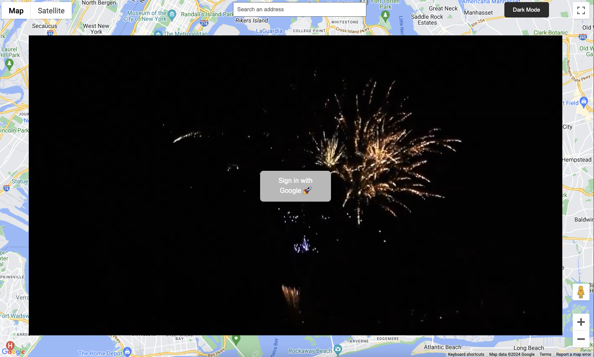
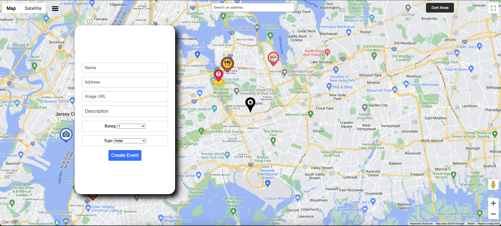
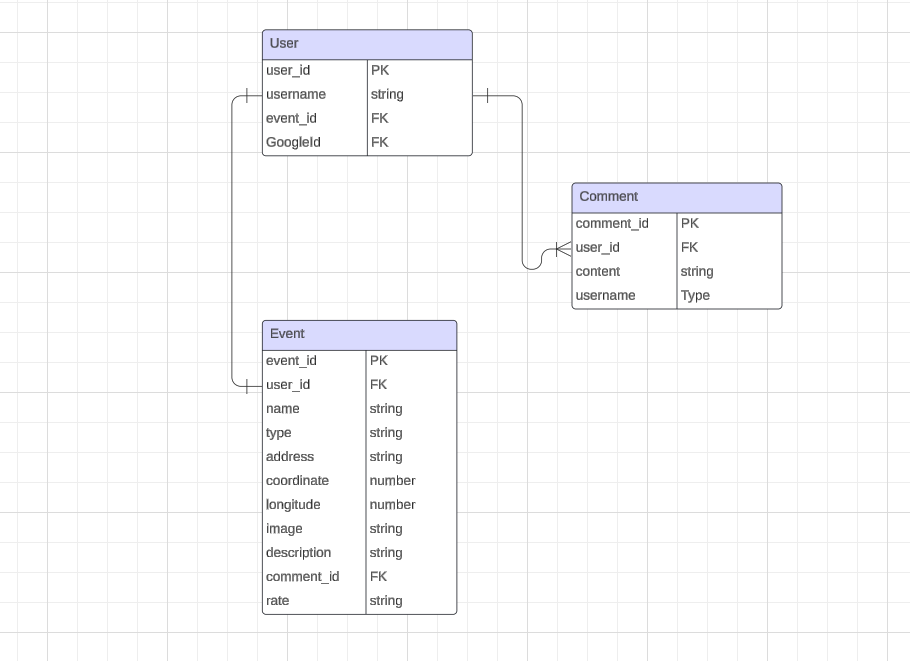

# project4

an app is named as Map Master google map api. Users are able to create their favorite locations and place them around the map with custom icon, and other user can make comment on the events.

login page

Creating event form

# How to use  this App
an app is designed for creating and sharing events using google map api. User must login  with gmail first.Then Users can create events, set up event details,type of event ,rating and locations, and notify other users.All user can make commit on the events.

## Technologies Used
-REACT
-Google Oauth
-Google Places API
-Google Geocoding API
-Google Maps API
-Node.js
-Express
-JSON
-Mongoose
-MongoDb
-CSS
-JavaScript

## MVP Goals
**CRUD**:Have full CRUD operations (POST, GET, PUT, DELETE) on event model.
**User Signin/Login/logout **: The user can register/login by gmail 
**Map**:Use google map api to generate map
**search place**:Use google place api to make an autocomplete search bar ,then use geocoding api to get lat and lng of that place,  
                  when autocomplete place was clicked, it will automatically direct to that exact place's location.
**comment**:All user can make comment for the event. 

## Stretch
-add game model
-add plan model
-the user can save their favorite events,and able to find it on user profile

## ERD
